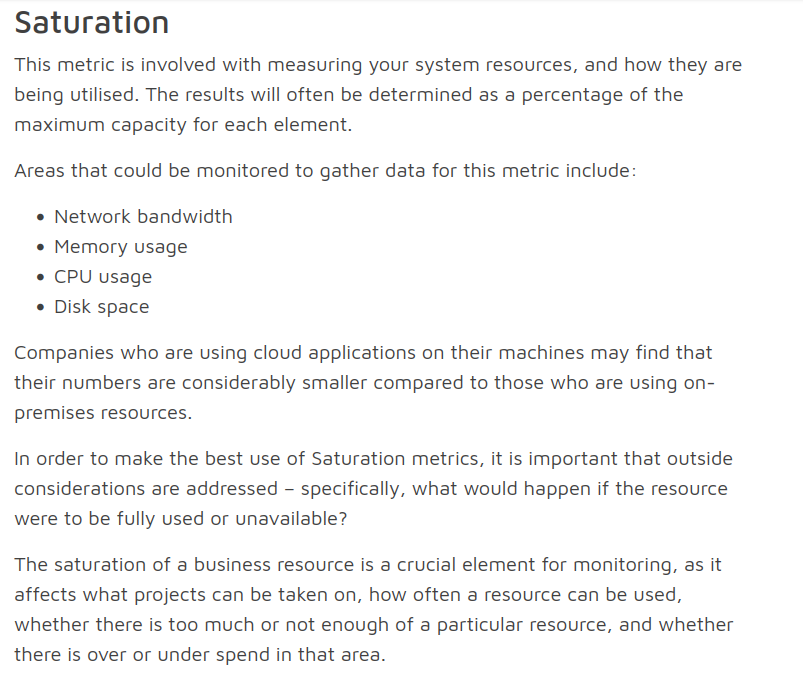

# Prática

## Métricas e Coleta

Physical device - tenho quais inputs vou usar, agora falta definir quais medidas vou usar

Virtual device - posso escolher varias coisas do cgroups, mas preciso escolher as medidas -> a dica é escolher medidas que façam overlap com o physical device

- **Próximos passos:**
  p0 - investigar os gaps nas medições (quem está falhando na coleta do dado? O prometheuis falha na coleta ou o container falha em disponibilizar o dado?)

  p1 - peneirar as métricas do cgroup - quais sao as mais interessantes? pq?

  p2 - Métricas dispositivo real x dispositivo simulado

  p3 - montar o dash do grafana

  p4 - estudo dos virtualizadores e tentar implementar o Raspberry + Telegraf (se der certo, segue para Android)
  
  p5 - Alarmes e Alertas

  p6 - Configurar os stress tests de acordo com as diretrizes definidas (testes individuais e depois simultaneos)

  p7 - Sugestao - subir um container só com telegraf, configurado para usar o plugin "inputs.docker" para coletar docker metrics para comparar com as métricas dos telegrafs embutidos nos outros containers :
          Docker metrics
          [[inputs.docker]]
            name_override = "container_docker_data"

  1. Montar Dash no Grafana com algumas métricas pra observar o comportamento já existente (validar se todos os dados estão idênticos novamente ou se estou monitorando isoladamento/corretamente)
  2. Simular Raspberry -> instalar telegraf e coletar métricas
  3. Simular Android -> como fazer o monitoramento?

  - Configurar os stress tests de acordo com as diretrizes definidas (testes individuais e depois simultaneos)
  - Métricas dispositivo real x dispositivo simulado
  - Alarmes e Alertas
  - Dispositivo Android e Raspberry

OBS - uma métrica importante seria a temepratura da CPU, mas essa métrica não faz sentido dos containers isolados na simulação

- **Quais são as métricas interessantes para memória?**  
  Qual o embasamento da decisão? ✖️
  Implementar a coleta. ✅
- **E para CPU? E para network? E para disco?**
CPU, DISK I/O, RAM coletas ✅
Embasamento teórico ✖️
Network ✖️
- **Quais stress tests são interessantes?**  
  Performar todos (CPU, memória, disco, network) ao mesmo tempo ou separadamente? Qual a carga dos testes?

## Itens para Implementação

1. Alarmes e alertas.
2. Stress tests aleatórios para simulações.
3. Simular dispositivo Android, Raspberry.
4. **Dispositivo real vs Dispositivo Simulado:**  
   Instalar o Node Exporter em um dispositivo real e simular este dispositivo real no Docker. Na sequência, comparar os resultados de ambos para avaliar o quanto o Docker influencia nos resultados.

---

# Anotações

## Troca do Node Exporter para o Telegraf

- Para telemetria de containers, o **Node Exporter** não é apropriado. Para todas as simulações, usar **Telegraf**. Para situações reais, cada situação pode exigir um agente diferente.
- O **Node Exporter** é bom para hosts Linux, mas não tem suporte para Android ou IoT.

## Custos da Troca

- O **Telegraf** se mostrou mais pesado. Quando rodei o Telegraf no **device_1**, o dispositivo crashava após um tempo. Com o **Node Exporter**, isso não acontecia.
- Além disso, o container demorava mais para ser construído. Antes, era quase instantâneo.

---

# Dúvidas

## Abordagens Possíveis

1. **Dispositivos Reais:**

   - Múltiplos agentes (Node Exporter para computadores, SNMP Exporter para dispositivos de rede, etc., o que for apropriado).

   **Pontos positivos:**

   - Cobertura do maior número de dispositivos possíveis.

   **Pontos negativos:**

   - Trabalho de configuração de exporters específicos para cada tipo de dispositivo.

2. **Dispositivos Simulados:**

   - **cAdvisor** para monitorar containers.

   **Pontos positivos:**

   - Praticidade e simplicidade.

   **Pontos negativos:**

   - Possível limitação na cobertura de dispositivos.

## Alternativa

- **Dispositivos reais e simulados com Telegraf.**

  **Pontos positivos:**

  - Maior isonomia e praticidade.

  **Pontos negativos:**

  - Não necessariamente consigo cobrir **todos** os dispositivos, talvez precise de outros agentes eventualmente.

---

# Embasamento

1. Estudar superficialmente como funcionam as especificações de hardware do Docker (memória, CPU, etc).
2. Entender melhor o fluxo de dados do **Prometheus** e **Grafana** (entrada, banco de dados, saída).
3. Levantar algumas opções de dashboard templates no **Grafana**.
4. Saber analisar o dashboard escolhido.

---

# Escrita

1. **Avaliação:**  
   Serei avaliado pelo esforço, portanto falar do trabalho dedicado ao **Zabbix** e da mudança para **Prometheus**.

## Como compartilhar meu progresso?

- Mandar o texto em PDF.
